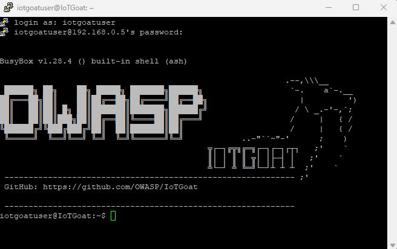
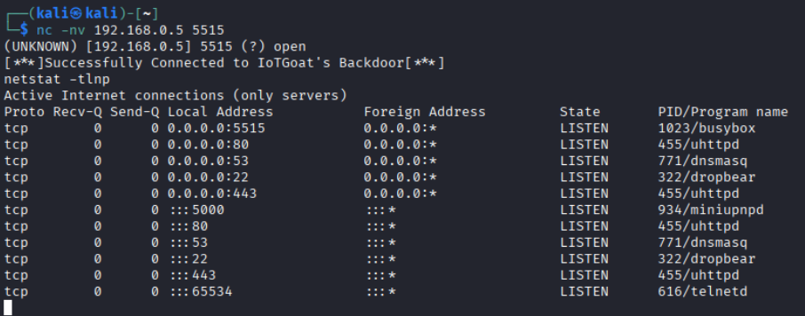
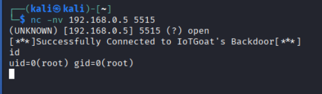
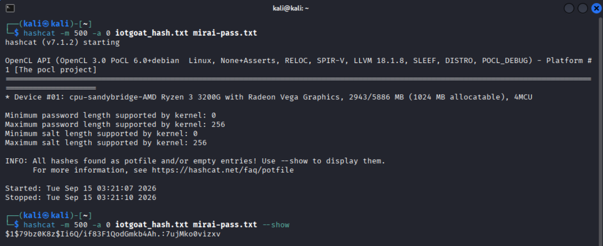

# IoTGoat Deployment & Vulnerability Assessment on Raspberry Pi 3

This repository documents my process of building, deploying, and testing [OWASP IoTGoat](https://github.com/OWASP/IoTGoat) — an official OWASP project providing deliberately vulnerable IoT firmware — on a Raspberry Pi 3 Model B, as part of a hands-on IoT security training environment.

**Note:** IoTGoat itself is created and maintained by OWASP. This repository documents my own deployment process, the issues I encountered and resolved, and the vulnerability assessment I performed on the resulting device — not the IoTGoat firmware itself.

## Project Goal

Research, deploy, and document OWASP IoTGoat to create a reusable, hands-on IoT security training environment for vulnerability assessment, firmware analysis, and device hardening exercises.

## Hardware & Environment

- **Target device:** Raspberry Pi 3 Model B
- **Build environment:** Ubuntu 18.04 LTS (VMware VM)
- **Host OS:** Windows

## The Build Journey

### 1. The official precompiled firmware image was broken

The [official IoTGoat v1.0 release](https://github.com/OWASP/IoTGoat/releases/tag/v1.0) provides a precompiled `IoTGoat-raspberry-pi2-sysupgrade.img` file. Attempting to flash this with Raspberry Pi Imager failed with:

```
Input file is not a valid disk image. File size 33306530 bytes is not a multiple of 512 bytes.
```

I confirmed this was a genuine defect in the release asset itself (not a corrupted download) by re-downloading multiple times and getting an identical byte count each time. A matching bug report from another user on the [official GitHub issue tracker](https://github.com/OWASP/IoTGoat/issues/2) confirmed this is a known, unresolved problem with the precompiled release.

### 2. Building from source instead

Since the precompiled release was unusable, I built the firmware from source:

- Set up a fresh **Ubuntu 18.04 LTS** VM (matching IoTGoat's documented build requirements — newer Ubuntu releases have known toolchain incompatibilities with the OpenWrt 18.06.2 base IoTGoat is built on)
- Installed all required build dependencies
- Cloned the IoTGoat repository and ran the standard OpenWrt build workflow:

```bash
git clone https://github.com/OWASP/IoTGoat.git
cd IoTGoat/OpenWrt/openwrt-18.06.2/
./scripts/feeds update -a
./scripts/feeds install -a
make menuconfig
make -j$(nproc)
```

- Confirmed the Raspberry Pi 3 is natively supported under the `BCM2709/BCM2710` target, with a Target Profile explicitly listing **"Raspberry Pi 2B/3B/3B+/3CM"**

### 3. First build was missing the intended vulnerable services

After successfully building and booting the first image, I found that only SSH and DNS were listening — **no web interface, no backdoor service**. Investigating further, I discovered the project ships a **`.config-rpi`** file in the OpenWrt build directory, containing the actual intended IoTGoat package selection (including LuCI and the intentional vulnerability set). This file needs to be copied in as `.config` *before* running `make menuconfig` — a step that's easy to miss, since a generic `make menuconfig` still produces a bootable image, just not the intended one.

```bash
cp .config-rpi .config
make menuconfig   # verify target, then save & exit
make -j$(nproc)
```

Rebuilding with this config produced a complete image with all of IoTGoat's intended services present.



*The OWASP/IoTGoat ASCII banner and GitHub link displayed on SSH login (via PuTTY), confirming the correct firmware — not generic OpenWrt — was successfully flashed and is running on the device.*

## Vulnerability Assessment

With a correctly-built image flashed and booted, I performed an initial assessment from a separate Kali Linux VM on the same network.

### Confirmed services (via `netstat` and `nmap`)

| Port | Service |
|------|---------|
| 22   | SSH (dropbear) |
| 53   | DNS (dnsmasq) |
| 80/443 | LuCI web interface (uhttpd) |
| 5000 | UPnP (miniupnpd) |
| 5515 | **Unauthenticated backdoor (shellback)** |
| 65534 | Telnet |


*Output of `netstat -tlnp` run as root via the backdoor shell, confirming all of IoTGoat's intended vulnerable services are present and listening: `uhttpd` (LuCI web interface, ports 80/443), `shellback` (unauthenticated backdoor, port 5515), `dropbear` (SSH, port 22), `dnsmasq` (DNS, port 53), and `miniupnpd` (UPnP, port 5000).*


### Exploiting the unauthenticated backdoor (port 5515)

```bash
nc -nv 192.168.0.3 5515
```


*Connecting to port 5515 via netcat immediately grants a root shell with no authentication required, confirmed via the `id` command returning `uid=0(root)`. This demonstrates OWASP IoT Top 10 category I2: Insecure Network Services.*

This returned an immediate, unauthenticated root shell:

```
[***]Successfully Connected to IoTGoat's Backdoor[***]
```

Confirmed with:

```bash
id
# uid=0(root) gid=0(root)
```

This maps to the OWASP IoT Top 10 category **I2: Insecure Network Services** — an unnecessary, unauthenticated service granting full device control.

### Cracking weak/hardcoded credentials

Using the root shell obtained above, I read `/etc/shadow` directly:

```bash
cat /etc/shadow
```

This exposed MD5-crypt password hashes for `root` and `iotgoatuser`. I cracked the `iotgoatuser` hash offline using `hashcat` against a small wordlist of common IoT default passwords (based on the Mirai botnet's known default credential list):

```bash
hashcat -m 500 -a 0 iotgoat_hash.txt mirai-pass.txt
```

Result: password cracked in under a second.


*Using hashcat with a wordlist of common IoT default passwords, the `iotgoatuser` MD5-crypt password hash was cracked, revealing the password `7ujMko0vizxv`. This demonstrates OWASP IoT Top 10 category I1: Weak, Guessable, or Hardcoded Passwords.*

This maps to OWASP IoT Top 10 category **I1: Weak, Guessable, or Hardcoded Passwords**.

## Key Takeaways

- Precompiled release assets can go stale/broken over time — always verify, and be prepared to build from source
- Project-specific build configuration files (like `.config-rpi`) matter — following generic tool documentation without checking for project-specific overrides can silently produce an incomplete result
- Weak network service exposure and hardcoded credentials remain trivially exploitable even in a modern lab setting, reinforcing why these categories top the OWASP IoT Top 10

## References

- [OWASP IoTGoat](https://github.com/OWASP/IoTGoat)
- [OWASP IoT Top 10](https://owasp.org/www-project-internet-of-things/)
- [IoTGoat Challenges Wiki](https://github.com/OWASP/IoTGoat/wiki)
